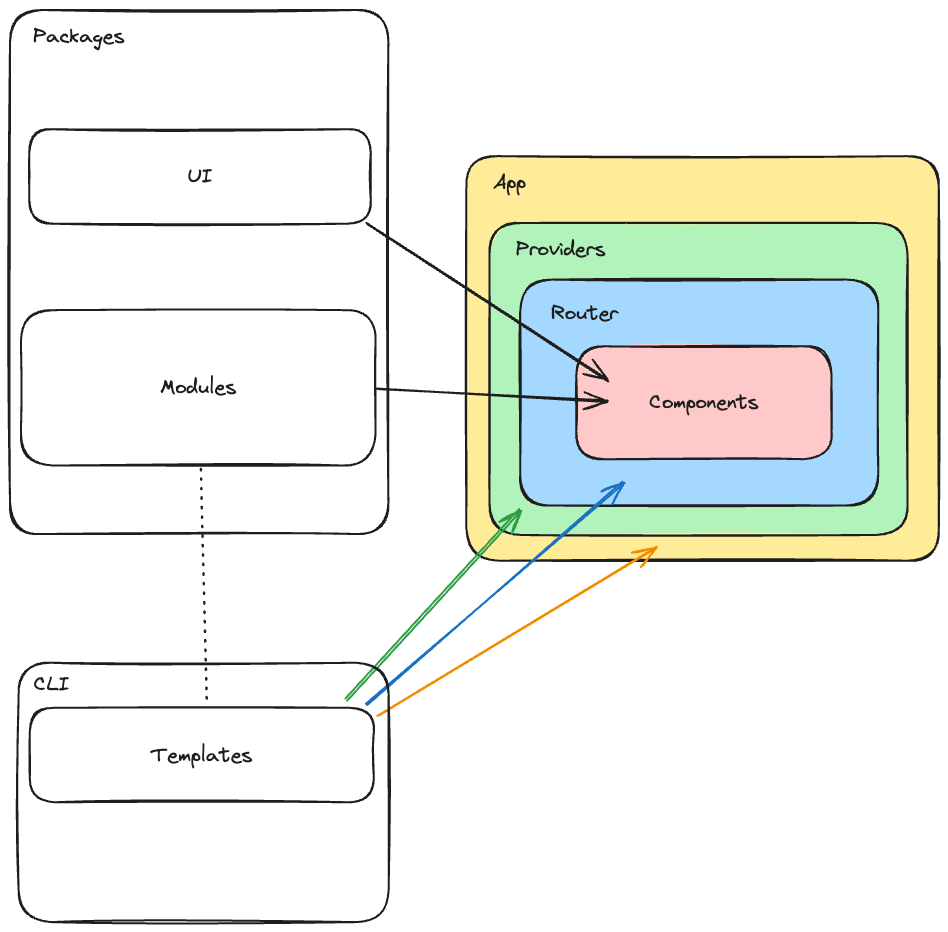

Open the terminal and run the following command to generate code:

```sh
sh ./start-frontend.sh
```

Result:

```
├── README.md
├── src
|  ├── app.tsx
|  ├── app-providers.tsx
|  ├── router.tsx
|  └── components
|     ├── authentication
|     |  ├── authentication.context.tsx
|     |  ├── index.ts
|     |  ├── types.ts
|     |  └── use-authentication.hook.ts
|     ├── button
|     |  ├── button.style.ts
|     |  ├── button.tsx
|     |  └── index.ts
|     ├── input
|     |  ├── index.ts
|     |  ├── input.style.ts
|     |  └── input.tsx
|     └── theme
|        ├── index.ts
|        ├── theme.context.tsx
|        └── use-theme.hook.ts
|
├── index.html
├── package.json
├── tsconfig.json
├── tsconfig.node.json
└── vite.config.ts
```


